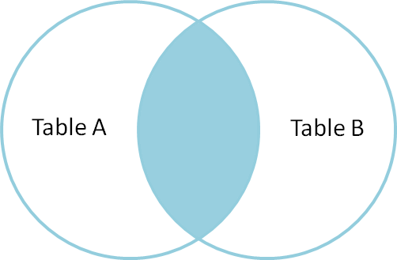
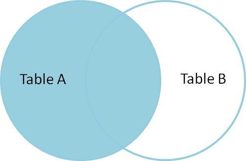
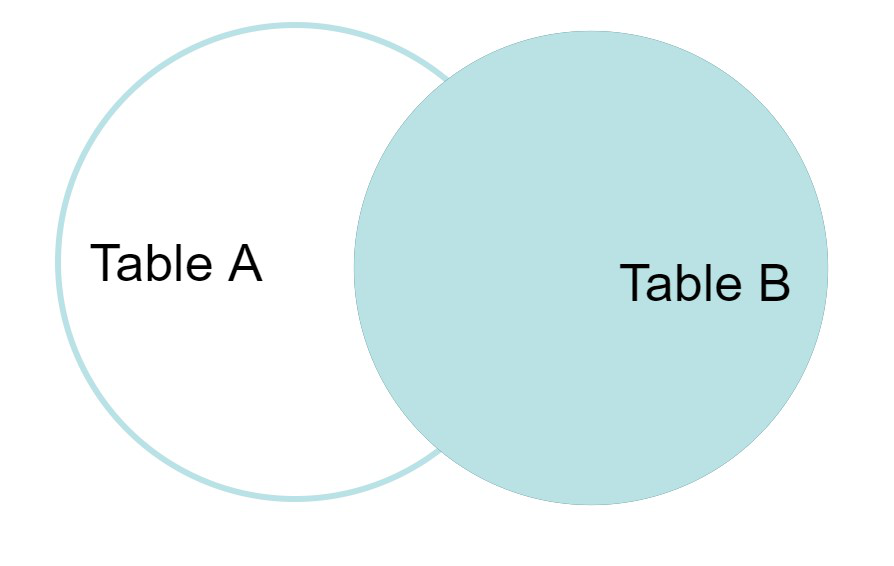
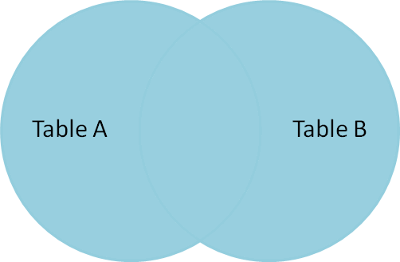

> search on JOIN [ self - inner - left - right ]

# Join

> JOIN is used for combine two tables or more.

```sql
SELECT table1.column1,table1.column2,table2.column1,....
FROM table1
INNER JOIN table2
ON table1.matching_column = table2.matching_column;
```

> example from: _GeeksforGeeks_

> INNER JOIN: returns rows when there is a match in both tables.
> means will get rows that has common 'matching_column' in both tables.



## Left Join

> returns all rows from the **left** table(`from` statment) and the matched rows from the right table(`join` statment). The result is NULL from the right side, if there is no match.



## Right Join

> returns all rows from the **right**
> table(`join` statment) and the matched rows from the left table(`from` statment). The result is NULL from the left side, if there is no match.



## Full Join

> returns all rows from the left table(`from` statment) and from the right table(`join` statment).


